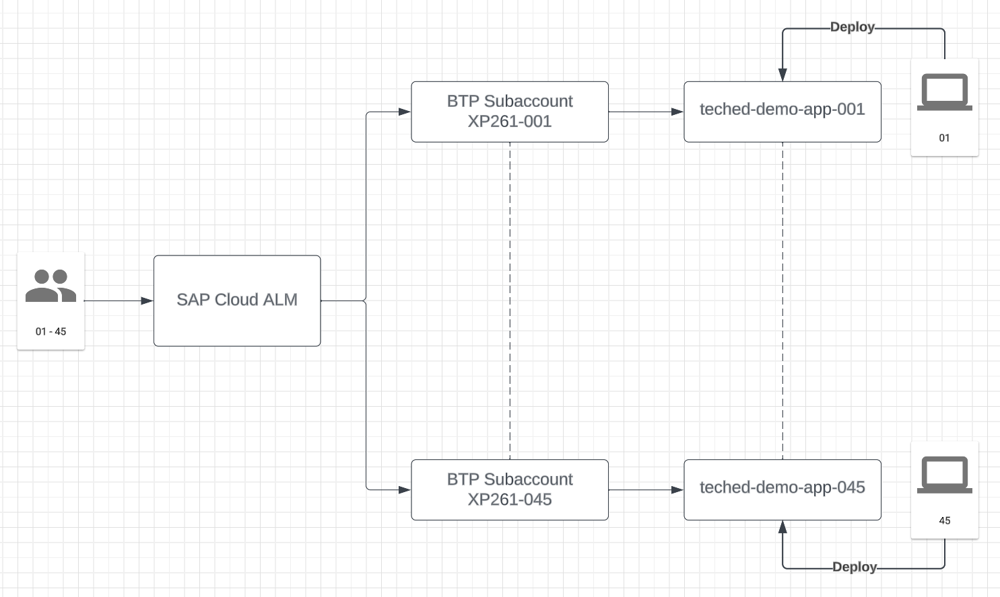
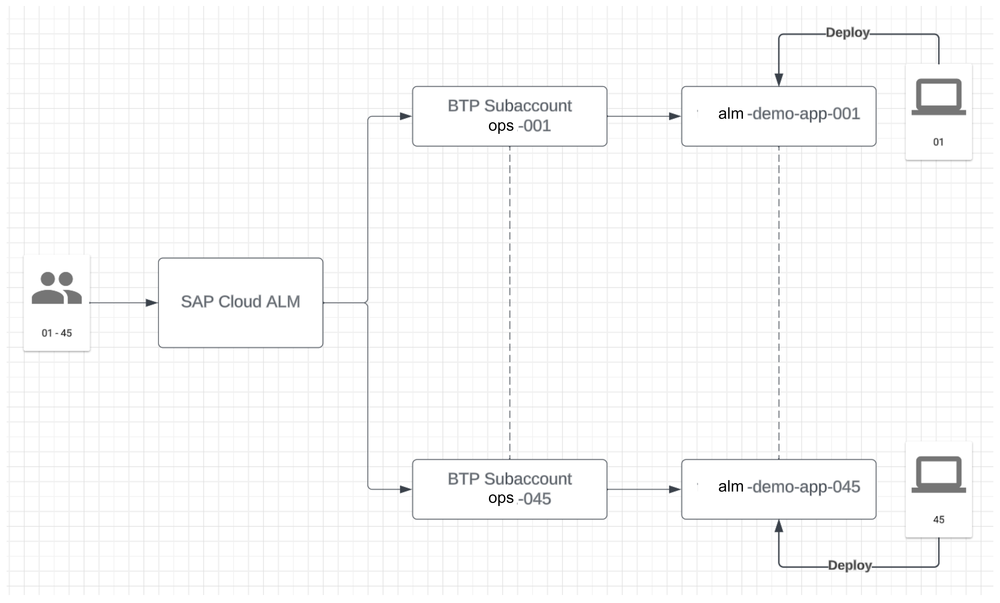

# Getting Started

In this exercise, you will gather important information to execute your exercise.

## Find your Group Number

During this exercise, you will instrument a Nodejs application and deploy it into an SAP BTP subaccount. You will then activate the monitoring for this NodeJs application in a shared SAP Cloud ALM. 
To avoid that it comes to conflicts between two applications, it is very important that you know your place number and execute the exercise using this place number.
Please check the sign on your table. The number on this sign is your place number. 
<!----->
<!--   -->

## Login Information

Please replace the ops-XXX in the user name with your place number (e.g. ops-001).

In the SAP BTP Cockpit, you will only see the subaccount that is relevant for you, based on your place number.

| Application | User ID | Password | URL |
|---|---|---|---|
| SAP Cloud ALM URL | ops-002 to ops-068 | Alm#Sap297! | [SAP Cloud ALM](https://alm-summit-apj-ops.eu20.alm.cloud.sap/launchpad#Shell-home) |
| SAP BTP Cockpit | ops-002 to ops-068 | Alm#Sap297! | [Global Account](https://emea.cockpit.btp.cloud.sap/cockpit/?idp=almsummit2024.accounts.ondemand.com#/globalaccount/d9a9f651-0f63-4e57-b56b-e6305c5cf0c1/) |

## Summary

Now that you have your login information ... 
Continue to - [Exercise 1 - Prepare Your Development Environment](../ex1/README.md)
