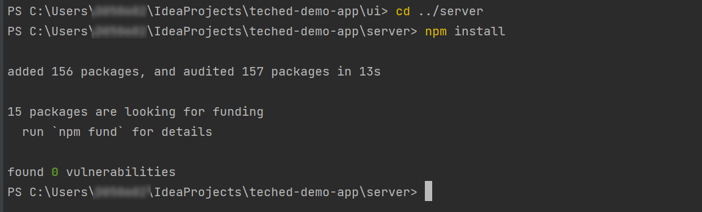

# Exercise 1 - Prepare Your Development Environment

In this exercise, we will instrument the Java application that you want to monitor with SAP Cloud ALM. 
In our sample scenario, we assume, that we want to monitor a full-stack application built on SAP BTP. The frontend consists of SAP UI5. The UI requests will be routed to the application backend via the Application Router. Here, the application backend consists of one microservice. In order to monitor the backend with SAP Cloud ALM this microservice is instrumented with DCI. To gather the client performance we leverage SAP UI5's ability to measure and export these Frontend Statistics Records (FESR). Our microservice acts as a receiver for these FESRs. This receiver is instrumented with both the DCI as well as the FESR receiver library. DCI will always export the data to the SAP Cloud ALM routing infrastructure. This routing infrastructure will route the data to the correct SAP Cloud ALM tenant.

<!----->


## Exercise 1.1 Copy Code from GitHub

The first step is to copy the sample application from this GitHub repository to your local development environment on your Teched laptop.

Open the IntelliJ IDEA Community Edition app on your Teched laptop:
<br><!----->


Select "Get from VCS"
<br><!----->


If IntelliJ opens with an already added project, please choose File > New > Project from Version Control
<br><!----->


Paste the following URL: https://github.com/SAP-samples/teched2023-XP261.git 
Then click on "Clone".
<br><!----->


You will now see the imported Node.js project in your IntelliJ project browser.
<br><!----->


In the project, there is a branch called 'non-instrumented' which is a non-instrumented version of the teched demo application.

To check out the non-instrumented branch, right-click on the root folder of your project and select "Git" -> "Branches"
<br><!----->


Open the tree "Remote" -> "origin" and select the entry "non-instrumented". Then click on "Checkout"
<br><!----->


## Exercise 1.2 Build initial Node.js application

We will now build and deploy the non-instrumented Node.js application.

The first step is to install all dependencies required by the application. We have to do this for the UI and the server component.

Select the tab "Terminal" in the lower left area of IntelliJ to open a new terminal.
<br><!----->


Switch to the ui folder using the command: 
```shell
cd .\teched-demo-app\ui
```
Then enter the command: 
```shell
npm install
```
<br><!----->

You can ignore any issues and warnings for now.

After the installation is finished, move to the server folder using the command: 
```shell
cd ..\server\
```
Again enter the command: 
```shell
npm install
```
<br><!----->


Now you can build the application. 

Switch back to the root directory using the command: 
```shell
cd ..
```
Enter the command: 
```shell
mbt build -t .
```
<br><!----->


After the build is successfully finished, you will find a new file teched-demo-app_1.28.0.mtar in your project directory.
<br><!----->


## Exercise 1.3 Connect to Cloud Foundry

Before you can deploy the application, you have to connect your local environment to the correct cloud foundry org.

Go to the Teched Global Account in [BTP Cockpit](https://amer.cockpit.btp.cloud.sap/cockpit/?idp=tdct3ched1.accounts.ondemand.com#/globalaccount/e2a835b0-3011-4c79-818a-d7767c4627cd)

Log on with your Teched User: XP261-0XX@education.cloud.sap
<br><!----->


Click on the subaccount for your place number: XP261-0XX
<br><!----->


In the Subaccount Overview, you will find the API Endpoint for your Cloud Foundry Org.
<br><!----->


For this Teched exercise, all subaccounts will be in the same region and hence have the same API endpoint. 

Go back to your IntelliJ. 

In your terminal enter the command: 
```shell
cf api https://api.cf.eu10-004.hana.ondemand.com
```
<br><!----->


Enter the command: 
```shell
cf login --origin tdct3ched1-platform 
```
Log on with your Teched user and password.
<br><!----->


You are now logged on to the Cloud Foundry org and your deployment will target the Teched demo space XP261-0XX.

## Exercise 1.4 Deploy initial Node.js application

The last step in this exercise is to deploy the Node.js application into the Cloud Foundry org.

In your terminal in IntelliJ run the command: 
```shell
cf deploy teched-demo-app_1.28.0.mtar
```
<br><!----->


Once the deployment is finished, you can find your deployed application in the BTP Cockpit.

In the Subaccount Overview click on the link for the application in the "Spaces" area. (You have to reload the browser window)
<br><!----->


In the "Applications" view you can see your two deployed apps. 
- teched-demo-app-sv: This is the backend application
- teched-demo-app-ui: This is the frontend application
<br><!----->


## Summary

You've now deployed a first, non-instrumented, version of your Node.js application. The next step is to prepare the infrastructure so it can send metrics to SAP Cloud ALM.

Continue to - [Exercise 2 - Enable Connectivity to SAP Cloud ALM](../ex2/README.md)
