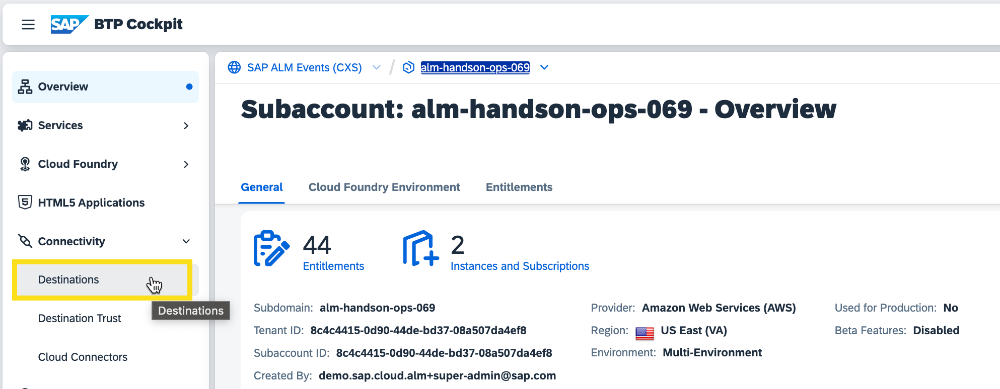

# Exercise 2 - Enable Connectivity to SAP Cloud ALM

In this exercise, we will enable the connectivity to SAP Cloud ALM and allow the data collection in SAP Cloud ALM.

The monitoring data is sent to SAP Cloud ALM via a destination using the destination service in your subaccount. The destination service was automatically subscribed and bound, when you deployed the first non-instrumented version of the application.

The destination points to the SAP Cloud ALM API in SAP Cloud ALM. To authenticate you need a service key for the APIs. 

## Exercise 2.1 Download SAP Cloud ALM Service Key from Landscape Management

The service key for the SAP Cloud ALM APIs was uploaded to the Landscape Management in your SAP Cloud ALM tenant. From there we will now retrieve it.

Log on to [SAP Cloud ALM](https://alm-summit-apj-ops.eu20.alm.cloud.sap/launchpad#Shell-home) with your alm summit user.

Click on "Administration" > "Landscape Management" to open the Landscape Management application.
 

If you open Landscape Management for the first time the scope selection will come up. You can just select all service types and click "Apply"
 

If the scope selection doesn't come up, you can click the "Scope" button to open it.
 

Open the Landscape Management configuration.
 

In the configuration, you find the tray "SAP Cloud ALM Service Key". Expand the tray.
 

Use the "Download" button to download the service key.
 

## Exercise 2.2 Create Destination in BTP Cockpit

Go back to [SAP BTP Cockpit](https://amer.cockpit.btp.cloud.sap/cockpit/?idp=tdct3ched1.accounts.ondemand.com#/globalaccount/e2a835b0-3011-4c79-818a-d7767c4627cd) and enter your subaccount. Click on "Connectivity" -> "Destinations"
 

Click "New Destination"
 

Enter the following values (replace XX with your place number):
- Name: CALM_datacollector
- Type: HTTP
- Description: Connection to SAP Cloud ALM
- URL: Enter endpoints:Api from the service key (1)
- Proxy Type: Internet
- Authentication: OAuth2ClientCredentials
- Client ID: Enter uaa:clientid from the service key (2)
- Client Secret: Enter uaa:clientsecret from the service key (3)
- Token Service URL Type: Dedicated
- Token Service URL: Enter uaa:url from the service key (4)
 

Save your destination.

In the end, your destination should look like this:
 

When you click the "Check Connection" button you should get this response:
 

## Exercise 2.3 Activate Data Collection in SAP Cloud ALM

Go back to your [SAP Cloud ALM](https://xp261-9kx159xc.eu10.alm.cloud.sap/launchpad#Shell-home) tenant.

Click "SAP Cloud ALM for Operations" > "Real User Monitoring"
 

Open the Scope Selection and select the SAP BTP, Cloud Foundry environment that matches the subaccount for your place number. 
You can use the Live Search to filter for your place number.
Click "Apply".
 

Open the Real User Monitoring configuration
 

Switch the data collection for your SAP BTP, Cloud Foundry environment from OFF to ON.
 

After the activation, the service should have the status "Active".
 

Go back to the SAP Cloud ALM Launchpad and click "SAP Cloud ALM for Operations" > "Health Monitoring"
 

Open the Scope Selection
 

In Health Monitoring only "Configured" services are visible in the scope selection by default. To find your configured BTP account, you have to change the filter parameter first. Click on "Toggle Filter Bar"
 

Change the "Service Status" to "All" and press the "Go" button.
 

Select the SAP BTP, Cloud Foundry environment that matches the subaccount for your place number. You can again use the Live Search to filter for your place number. Click "Apply".
 

Open the Health Monitoring configuration
 

Switch the data collection for your SAP BTP, Cloud Foundry environment from OFF to ON.
 

 

## Summary

You've now enabled the SAP BTP Cloud Foundry to send monitoring data to SAP Cloud ALM Real User Monitoring and Health Monitoring.

The next step is to instrument your application, so it will collect monitoring data.

Continue to - [Exercise 3 - Instrument your Demo Application](../ex3/README.md)
