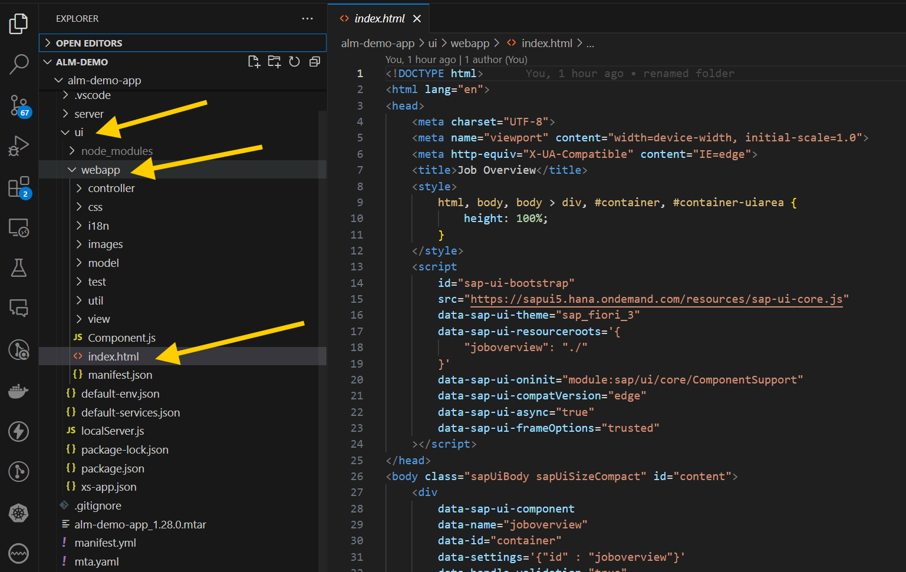
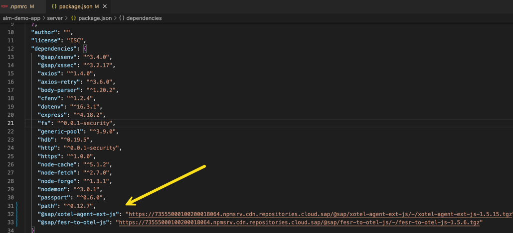
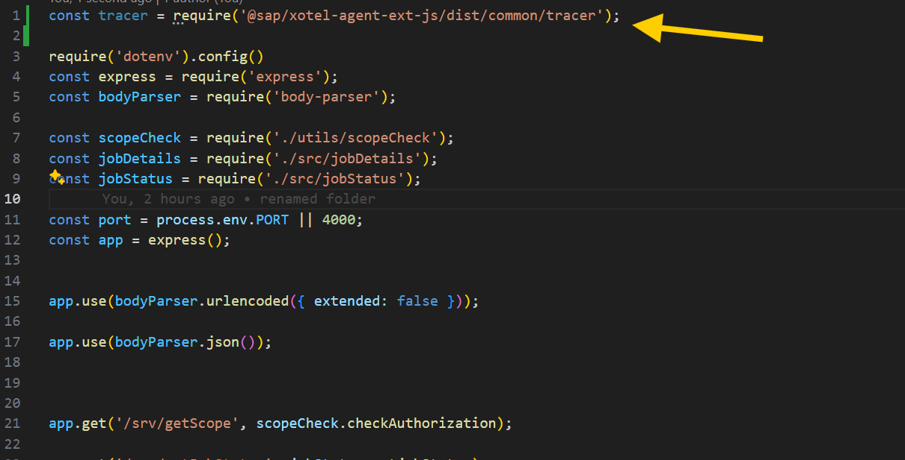

# Exercise 3 - Instrument your Demo Application

Now comes the most important part. In this exercise, we will finally instrument your Node.js application.

## Exercise 3.1 Instrument UI Application

Let's start with the UI application. Here we have to add the FESR instrumentation to collect Frontend Statistics Records automatically.

### Add FESR beacon to index.html
In your project in VSCode expand alm-demo-app > ui > webapp and open the index.html file
<!-- <br> -->


Insert this line of code after line 6.
```html
<meta name="sap-ui-fesr" content="/fesr">
```
<!-- <br> -->


### Add FESR route to xs-app.json 
Now open the xs-app.json file in the expand alm-demo-app > ui folder
<!-- <br> -->


Insert the following code after line 2.
```json
{
	"source": "^/fesr$",
	"target": "/fesr",
	"destination": "srv_api",
	"csrfProtection": false,
	"authenticationType": "none"
},
```
<!-- <br> -->


Now your ui application can send Frontend Statistics Records to the server application. 

## Exercise 3.2 Instrument Server Application

The next step is to instrument your server application. Before we start with this we have to enable your application to download the OTEL ALM Libraries.

### Configure Download Settings
The OTEL ALM Libraries are shipped by SAP Repository Based Shipment Channel (RSBC). To access them you need a technical username and password in the RBSC. 
We already requested a user for you.
In your VSCode project expand the expand alm-demo-app > server folder and open the .npmrc file
<!-- <br> -->


Replace the current content with this line of code
```
//73555000100200018064.npmsrv.cdn.repositories.cloud.sap/:_auth=MDAwMDIwMjQxOC1BbG1zdW1taXQ6SzFKbG5oYVNJclBvdjV6UzQ1ZjJpRGNaVTY2eDBEQmk=
```
<br>

### Add Dependencies
Now you have to add the OTEL agent dependencies. 
In the alm-demo-app > server folder open the package.json file
<!-- <br> -->


Insert the following code after line 31.
```json
    "@sap/xotel-agent-ext-js": "https://73555000100200018064.npmsrv.cdn.repositories.cloud.sap/@sap/xotel-agent-ext-js/-/xotel-agent-ext-js-1.5.15.tgz",
    "@sap/fesr-to-otel-js": "https://73555000100200018064.npmsrv.cdn.repositories.cloud.sap/@sap/fesr-to-otel-js/-/fesr-to-otel-js-1.5.6.tgz"
```
**Don't forget to add a ',' behind the entry in line 31.**
<!-- <br> -->


With the new dependencies, we have to rerun the npm install.

In the terminal in VScode go to the server directory using the command: 
```shell
cd server
```
Then run the command: 
```shell
npm install
```
<!-- <br> -->


### Add tracer and FESR receiver server.js
In the alm-demo-app > server folder open the file server.js
<!-- <br> -->


Insert the following code as the new first line of the file
```js
const tracer = require('@sap/xotel-agent-ext-js/dist/common/tracer');
```
<!-- <br> -->


Now in the same file add the following line of code after line 10
```js
const fesr = require("@sap/fesr-to-otel-js");
```
And add the following line after the new line 15
```js
fesr.registerFesrEndpoint(app)
```
After this, your server.js file should look like this:
<!-- <br> -->


### Add Properties to mta.yaml
Last but not least you have to add some properties to the mta.yaml

Copy the following code into a Notepad
```
    properties:
		SAP_CALM_SERVICE_TYPE: SAP_CP_CF
		SAP_CALM_SERVICE_NAME: alm-demo-app-0XX
		SAP_CALM_DCI_AGG_THRESHOLD: 1
		OTEL_POLL_INTERVAL: 300
		OTEL_RESOURCE_ATTRIBUTES: account=alm-demo-app-0XX,sap.tenancy.tenant_id=<your subaccount id>    
```

Replace the XX in the properties SAP_CALM_SERVICE_NAME and OTEL_RESOURCE_ATTRIBUTES with your **place number**.

Now go to your _subaccount_ via the [SAP BTP Cockpit](https://emea.cockpit.btp.cloud.sap/cockpit?idp=almsummit2024.accounts.ondemand.com#/globalaccount/d9a9f651-0f63-4e57-b56b-e6305c5cf0c1)

Enter your subaccount.

In the Subaccount Overview, you will find the _subaccount ID_
<br>

Copy the value and enter it as value for **sap.tenancy.tenant_id** in your code fragment.

Your code fragment should now look similar to this:
```
    properties:
      SAP_CALM_SERVICE_TYPE: SAP_CP_CF
      SAP_CALM_SERVICE_NAME: alm-demo-app-001
      SAP_CALM_DCI_AGG_THRESHOLD: 1
      OTEL_POLL_INTERVAL: 300
      OTEL_RESOURCE_ATTRIBUTES: account=alm-demo-app-001,sap.tenancy.tenant_id=87993b94-3664-40cc-9156-db9b50b08c94
```

In the alm-demo-app folder open the file mta.yaml
<!-- <br> -->


Add the code from your Notepad after line 23 (after the property "path") in the mta.yaml
<!-- <br> -->


## Exercise 3.3 Deploy instrumented Node.js application

Now you can build and deploy your application again.

Note: Kindly check whether you have saved all of your changes before proceeding further.

Switch back to the root directory and remove the existing file: 
```shell
cd ..
rm alm-demo-app_1.28.0.mtar
```
Now Enter the command: 
```shell
mbt build -t .
```
<!-- <br> -->


After the build is successfully finished, you will find a new file alm-demo-app_1.28.0.mtar in your project directory.
<!-- <br> -->


In your terminal in IntelliJ run the command: 
```shell
cf deploy alm-demo-app_1.28.0.mtar
```
<!-- <br> -->


Once the deployment is finished, you can find your running application in the BTP Cockpit.

## Exercise 3.4 Create some traffic in your application

In the Subaccount Overview click on the link for the application in the "Spaces" area. (You have to reload the browser window)
<!-- <br> -->


In the "Applications" view you can see your two deployed apps. 
- alm-demo-app-sv: This is the backend application
- alm-demo-app-ui: This is the frontend application
<!-- <br> -->


Right-click on the app alm-demo-app-ui and select "Open link in new tab"
<!-- <br> -->


In the new tab, click on the link under "Application Routes"
<!-- <br> -->


The application will open in a new tab. 
<br>

Click around in the application to create some traffic. Filter for jobs and drill into the table. This will create metrics that you can later see in Real User Monitoring.

## Summary

You've now instrumented your CALM demo application. You also created some traffic. You can now look at the metrics in SAP Cloud ALM.

Continue to - [Exercise 4 - Observe Metrics in SAP Cloud ALM](../ex4/README.md)

