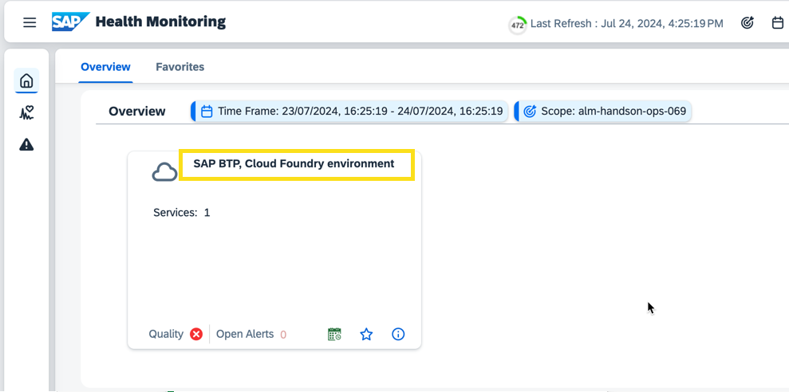
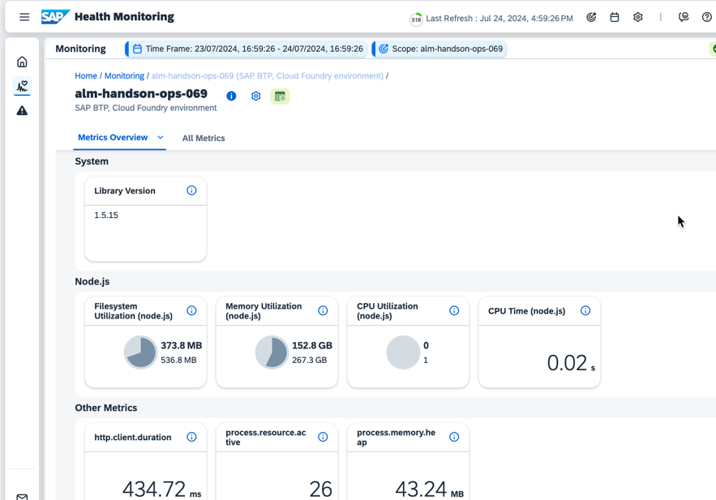
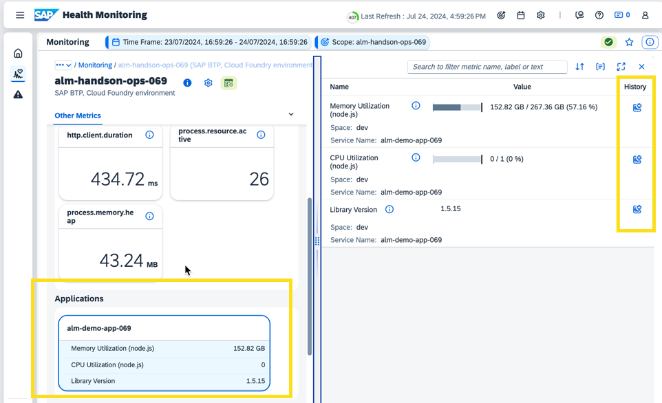

# Exercise 4 - Observe Metrics in SAP Cloud ALM

In this last exercise, we will finally observe the metrics we created in SAP Cloud ALM.
The metrics sent by the custom application are attached to the SAP BTP Cloud Foundry environment in which the app is running.

## Exercise 4.1 Check metrics in Health Monitoring

Go back to the SAP Cloud ALM Launchpad and click "SAP Cloud ALM for Operations" > "Health Monitoring"
 

SAP BTP Cloud Foundry environment in which your instrumented app is running is already in scope for Health Monitoring.

On the Overview screen, you can see the card of your SAP BTP Cloud Foundry environment. In the card, you see an overview of the collected metrics.
Click on the service type to drill into the details.
 

Click on the line for your service:
 

In the detail screen, you can see all metrics that are currently supported for Node.js
 

Click on the card for the application. On the right, you see all metrics that are reported by your application. You can use the "History" button to see past values for the metric, after the monitoring is active for some time.
 

## Exercise 4.2 Check metrics in Real User Monitoring

Go to your [SAP Cloud ALM](https://xp261-9kx159xc.eu10.alm.cloud.sap/launchpad#Shell-home) tenant.

Click "SAP Cloud ALM for Operations" -> "Real User Monitoring"
 

The SAP BTP Cloud Foundry environment in which your instrumented app is running is already in scope for Real User Monitoring.

On the Overview screen, you can see the card of your SAP BTP Cloud Foundry environment. In the card, you see an overview of the collected metrics.
Click on the name to drill into the details.
 

In the "Requests" view you can drill further down:
 

Sort the next list by Average Response Time:
 

Click on the name of the longest-running request:
 

Click on the Execution:
 

In the following screen you can see the request tree and analyze the requests further:
 

## Summary

You've now reached the end of this hands-on exercise. You have successfully instrumented a custom BTP application and enabled it to send metrics to SAP Cloud ALM. 

In this hands-on session, you instrumented a custom-built Node.js application. You can also instrument your custom-built Java applications. You can find more information on how to do this in the [SAP Cloud ALM for Operations Expert Portal](https://support.sap.com/en/alm/sap-cloud-alm/operations/expert-portal/data-collection-infrastructure.html).

Congratulations!
